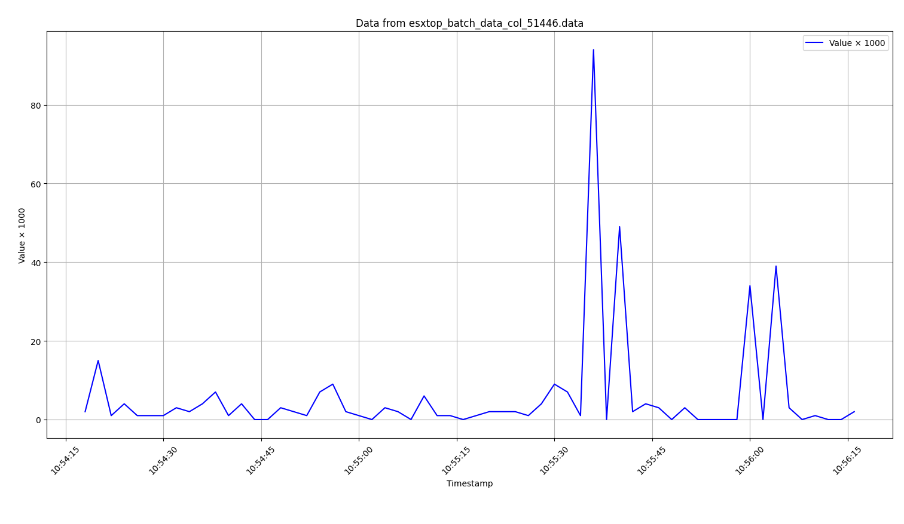

# esxtop-batch-data-visualizer
Visualize performance data from esxtop batch mode CSV exports. This tool extracts, filters, and graphs key VM and host metrics (CPU, disk, memory, etc.) from large esxtop datasets, helping analyze performance trends over time.

## Quick Start

### Using the Makefile (Recommended)

```sh
# Set up virtual environment (first time only)
make venv

# Describe the CSV file
make describe CSV_FILE=esxtop_batch_data.csv

# Find column index
make find-column CSV_FILE=esxtop_batch_data.csv SEARCH_PATTERN="scsi.*Write"

# Extract and plot data
make extract CSV_FILE=esxtop_batch_data.csv COL_ID=51446
make plot DATA_FILE=esxtop_batch_data_col_51446.data SCALE=1.0

# Or save to PNG
make plot-save CSV_FILE=esxtop_batch_data.csv COL_ID=51446 SCALE=1.0
```

### Using Docker (Web Interface)

The easiest way to use this tool is via the Docker web interface:

```sh
# Using docker-compose (recommended)
docker-compose up -d

# Or build and run manually
docker build -t esxtop-analyzer .
docker run -p 5000:5000 esxtop-analyzer
```

Then open http://localhost:5000 in your browser.

**Web Interface Features:**
- Drag-and-drop CSV file upload (up to 500MB)
- Select analysis type: VMDK only, Physical Disk only, or Both
- View results directly in browser
- Download generated data files

**Docker Commands:**
```sh
# Start the container
docker-compose up -d

# View logs
docker-compose logs -f

# Stop the container
docker-compose down

# Rebuild after changes
docker-compose up -d --build
```

### Manual Usage

1. **Collect esxtop batch data** as mentioned [here](https://knowledge.broadcom.com/external/article/370279/collecting-esxtop-batch-data-for-esxi-pe.html)

2. **Describe collected batch data** from CSV file
   ```sh
   ./scripts/describe_extop.sh esxtop_batch_data.csv
   ```

3. **Find column index** of interest
   ```sh
   python3 scripts/find_column_idx.py esxtop_batch_data.csv | grep -E -B 4 "scsi.*Write"
   ```
   Example output:
   ```
   Column 51446 RAW \\esx01.example.com\Virtual Disk(EXAMPLE_VM_NAME:scsi3:0)\Average MilliSec/Write
   ```

4. **Extract time series data** from the chosen column
   ```sh
   python3 scripts/extract_column.py esxtop_batch_data.csv 51446
   ```
   This generates `col_51446.data` with timestamped metric values.

5. **Visualize the data**
   ```sh
   # Interactive plot
   python3 scripts/visualize_data.py col_51446.data --scale 1.0

   # Save to PNG
   python3 scripts/visualize_data.py col_51446.data --scale 1.0 -o output.png --no-show
   ```



## Library Usage

The package can also be used as a Python library:

```python
from esxtop_visualizer import (
    parse_csv_header,
    find_columns_by_pattern,
    extract_and_save,
    visualize,
)

# Parse CSV headers
columns = parse_csv_header("esxtop_batch.csv")
print(f"Found {len(columns)} columns")

# Find specific columns
write_latency_cols = find_columns_by_pattern("esxtop_batch.csv", r"scsi.*Write")
for col in write_latency_cols:
    print(f"Column {col.index}: {col.counter}")

# Extract time series data
extract_and_save("esxtop_batch.csv", column_index=51446)

# Visualize
visualize("col_51446.data", scale=100.0, output_file="chart.png", show=True)
```

## Project Structure

```
esxtop-batch-data-visualizer/
├── src/esxtop_visualizer/   # Core library modules
│   ├── parser.py            # CSV parsing
│   ├── extractor.py         # Data extraction
│   └── visualizer.py        # Plotting
├── scripts/                 # CLI tools
│   ├── find_column_idx.py
│   ├── extract_column.py
│   ├── visualize_data.py
│   ├── describe_extop.sh
│   └── describe_physical_disk.sh
├── templates/               # Web UI templates
│   └── index.html
├── tests/                   # Test suite
├── app.py                   # Flask web application
├── Dockerfile               # Docker build configuration
├── docker-compose.yml       # Docker Compose configuration
├── Makefile                 # Build automation
└── pyproject.toml           # Package configuration
```

## Development

### Running Tests

```sh
# Install dev dependencies
pip install -e ".[dev]"

# Run tests
pytest tests/ -v

# With coverage
pytest tests/ --cov=esxtop_visualizer --cov-report=html
```

### Installing in Development Mode

```sh
pip install -e .
```

This allows you to import the package from anywhere while making live edits.


## Feature Roadmap

**Completed:**
- [x] Parse large CSV files exported by esxtop in batch mode
- [x] Extract column metadata (host, category, counter)
- [x] Filter by specific performance metrics (e.g., virtualdisk latency, device latency)
- [x] Generate time series data from a selected metric
- [x] Plot data with time on the X-axis and metric values on the Y-axis
- [x] Export charts as PNG for reporting
- [x] Module structure for library usage
- [x] Comprehensive test suite foundation
- [x] Makefile automation
- [x] Docker containerization with web interface
- [x] Physical Disk SCSI Device analysis (naa.*)
- [x] VMDK Read/Write latency summary tables

**Planned:**
- [ ] Latency threshold alerting - Highlight VMDKs/devices exceeding thresholds (e.g., >20ms warning, >50ms critical) with color-coded output
- [ ] Percentile statistics (P50/P95/P99) - Add percentile latency metrics to summary tables for better tail latency analysis
- [ ] CSV/JSON export of summary tables - Export latency summaries for Excel analysis or monitoring tool integration
- [ ] Multi-file comparison - Compare metrics between two esxtop captures (before/after analysis)
- [ ] Interactive HTML report - Generate standalone HTML with embedded Plotly charts for easy sharing
- [ ] IOPS/throughput analysis - Add Commands/sec and KB/sec metrics alongside latency
- [ ] REST API endpoints - Expand web interface with API for automation/CI integration
- [ ] Support multiple column extraction and chart overlay
- [ ] Expand test coverage with fixtures
